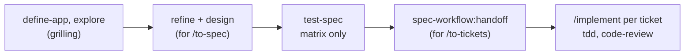

# toolbox

Personal plugin marketplace for [Claude Code](https://claude.com/claude-code) and [Oh My Pi](https://github.com/can1357/oh-my-pi). One repo, several plugins; installs track this repository, so updating a plugin is `git push` here and `/plugin marketplace update` (or the background auto-update) everywhere else.

Currently shipping:

| Plugin | What it does |
|---|---|
| `spec-workflow` | Spec-first development workflow: define the product, explore → refine → (wireframe) → design → test-spec each feature, validate spec and tests *before* code, with a traceability lint, a local review site with comment-driven feedback, and handoff to Backlog.md tasks. |
| `quality-gate` | Guided [qlty](https://qlty.sh) setup: profile the project, decide which checks and thresholds actually earn their noise, apply a tailored `.qlty/qlty.toml`, baseline existing debt without a flag-day cleanup, then enforce the gate in CI, git hooks and agent instructions — with the reasoning committed as `docs/quality/policy.md`. |
| `prose-gate` | Guided [Vale](https://vale.sh) setup aimed at the prose agents write — preamble, self-narration, marketing adjectives, hedging, sign-offs. Profiles a repo, decides which rules earn their noise, then enforces them *while an agent writes* through a self-limiting PostToolUse hook, with CI as the backstop. |

## Install (Claude Code)

```shell
/plugin marketplace add jctosta/toolbox
/plugin install spec-workflow@jctosta-toolbox
/plugin install quality-gate@jctosta-toolbox
/plugin install prose-gate@jctosta-toolbox
```

Then either invoke the phase commands directly:

```shell
/spec-workflow:status
/spec-workflow:define-app
/spec-workflow:explore checkout-flow "users abandon at the payment step"
/spec-workflow:refine checkout-flow
/spec-workflow:wireframe checkout-flow
/spec-workflow:design checkout-flow
/spec-workflow:test-spec checkout-flow
/spec-workflow:feedback checkout-flow
/spec-workflow:handoff checkout-flow
/spec-workflow:lint
/spec-workflow:site
/spec-workflow:embrace-the-grill
```

```shell
/quality-gate:status
/quality-gate:assess
/quality-gate:propose
/quality-gate:apply
/quality-gate:baseline
/quality-gate:enforce
```

```shell
/prose-gate:status
/prose-gate:assess
/prose-gate:propose
/prose-gate:apply
/prose-gate:enforce
```

…or just talk ("spec this out", "where are we", "apply the review comments", "set up a quality gate",
"what should we actually lint") — the skills route by intent too.

### spec-workflow with mattpocock-skills

When [mattpocock-skills](https://github.com/mattpocock/skills) is installed, spec-workflow runs the front
of its main flow and hands implementation to `/implement`. Without it, nothing changes.



- The glossary lives in `CONTEXT.md`; `domain.md` keeps lifecycles and invariants.
- `tests.md` sets `skeletons | per-slice`, so `tdd` writes each test inside its ticket.
- Tickets are tracer-bullet slices published through `docs/agents/issue-tracker.md`. Run
  `/setup-matt-pocock-skills` first.
- A repo already using spec-workflow switches with `/spec-workflow:embrace-the-grill` after setup.

## Install (Oh My Pi)

```shell
omp plugin marketplace add jctosta/toolbox
omp plugin install spec-workflow@jctosta-toolbox
omp plugin install quality-gate@jctosta-toolbox
omp plugin install prose-gate@jctosta-toolbox
```

Same commands (`/spec-workflow:explore …`), same skills. If you already installed the plugin through
Claude Code, omp reads `~/.claude/plugins/installed_plugins.json` too and picks it up with no second install.

Each plugin ships a root `plugin.json` declaring [Agent Plugins 1.0.0](https://agent-plugins.org), so omp
loads the skill through its portable-standard provider rather than the Claude-compatibility fallback. The
commands still come from the Claude side — that surface isn't part of the standard, and omp supports the
mix deliberately.

## Enable per project

Commit this to a project's `.claude/settings.json` so the marketplace registers (after folder trust) and the plugin is on by default for that repo:

```json
{
  "extraKnownMarketplaces": {
    "jctosta-toolbox": {
      "source": { "source": "github", "repo": "jctosta/toolbox" }
    }
  },
  "enabledPlugins": {
    "spec-workflow@jctosta-toolbox": true
  }
}
```

## Updating

- **Claude Code**: no version is pinned in `plugin.json` on purpose — for git sources the resolved commit SHA is the version, so every push here is an update. Users pick it up via background auto-update or `/plugin marketplace update jctosta-toolbox`. If this ever becomes public-facing, switch to explicit `version` + tags and bump on every release.
- **claude.ai / mobile**: skill uploads there don't track git. Tag a release (`git tag v2026.09.01 && git push --tags`) and the release workflow attaches a `<skill>.skill` file to the GitHub Release; download it and re-upload in Settings → Capabilities.

## Repository layout

```
.claude-plugin/marketplace.json      # the catalog; omp reads it as its documented fallback
plugins/
  spec-workflow/
    plugin.json                      # Agent Plugins manifest — omp and any standard client
    .claude-plugin/plugin.json       # Claude Code manifest (no version field — see Updating)
    commands/                        # thin /spec-workflow:<phase> wrappers
    skills/spec-workflow/            # the actual skill
      SKILL.md                       # router + shared conventions
      references/                    # one file per phase, read on demand
      assets/templates/              # artifact templates
      scripts/                       # spec_lint.py, spec_status.py, spec_site.py
      examples/                      # worked example that CI keeps honest
  quality-gate/
    plugin.json                      # same manifest pair as above
    .claude-plugin/plugin.json
    commands/                        # thin /quality-gate:<phase> wrappers
    skills/quality-gate/
      SKILL.md                       # router + shared conventions
      references/                    # one per phase, plus choosing-checks.md and plugin-catalog.md
      assets/templates/              # policy.md, qlty.toml, quality-gate.yml, agents-snippet.md
      scripts/                       # qlty_advisor.py
  prose-gate/
    plugin.json                      # same manifest pair as above
    .claude-plugin/plugin.json
    .lsp.json                        # vale-ls, for editors and agents that have it
    hooks/                           # hooks.json + vale_gate.py — active on install,
                                     #   silent in any repo without a .vale.ini
    commands/                        # thin /prose-gate:<phase> wrappers
    skills/prose-gate/
      SKILL.md                       # router + shared conventions
      references/                    # one per phase, plus choosing-rules.md
      assets/templates/              # policy.md, vale.ini, prose.yml, agents-snippet.md
      assets/styles/Agentic/         # the 15 vendored rules this repo also lints itself with
      assets/testdata/               # fixture written to trip every rule
      scripts/                       # vale_advisor.py
.vale.ini                            # this repo lints its own prose with the shipped style
tests/run_checks.py                  # CI entry point
.github/workflows/ci.yml             # checks on every push/PR
.github/workflows/release.yml        # .skill artifacts on tags
```

## CI

`tests/run_checks.py` (runs on every push and PR):

1. The worked example passes `spec_lint` with **0 errors, 0 warnings** — it's the calibration target the skill points agents at, so it must stay clean — and its wireframes stay self-contained (coverage comment on line 1, shared stylesheet, CDN import).
2. Nine deliberately broken copies of the example each trigger the lint (wrong scenario heading, missing WHEN, implementation word in the spec, test-ID mismatch, uncovered scenario, blocking question on an approved brief, wireframe covering an unknown scenario, dead wireframe link, main flow with no screen).
3. `spec_status` parses the example and derives the expected phase.
4. The review site's embedded JS parses (`node --check`), the sidebar lists a feature's wireframes, and a comment round-trips through `feedback.md` (append → parse → resolve) — for a Markdown artifact and for a wireframe screen.
5. The example's mermaid diagrams parse and a malformed one is caught with its line (needs `@probelabs/maid`; skipped without it).
6. Every artifact's header is a two-column table that parses (escaped pipes included), and the legacy `key: value` block still parses.
7. Code markers stay scoped per feature: two features sharing `S-01.1` don't satisfy each other, and `.spec-lint.json` can map test files to a slug.
8. A brief marked `shipped` only reads as terminal once the lint, the open feedback, the mandatory artifacts and `tests.md` back it up.
9. Every `plugin.json` and `SKILL.md` conforms to the closed Agent Plugins 1.0.0 schemas, and the two manifests agree. Both schemas reject silently at runtime — an unexpected `SKILL.md` frontmatter key or a description past 1024 characters just drops the skill — so eight deliberately broken copies check that the validator actually bites.
10. `quality-gate`'s advisor profiles fixture repositories correctly (languages, tools declared in `pyproject.toml` and `package.json`, monorepo sub-projects, hook runners, CI provider), and its `verify` catches a `qlty.toml` that is malformed or inconsistent with the repo it sits in — a plugin enabled for a language that isn't there, a linter the repo already configures being shadowed, a suppression with no stated reason, and a `[smells.*]` key qlty will silently drop — the trap where a check you believe you disabled is still running and `qlty config validate` still exits 0. The four templates it ships stay parseable and complete, and the CI template names the plugins allowed to fail the build.

11. `prose-gate`'s vendored style holds up: every rule declares a level and a pattern that compiles, the `Emoji` rule catches real emoji but not the `→` this repo uses as punctuation (with a guard so that check can't pass once the convention disappears), the shipped vocabulary stays empty of project names, and the fixture still trips all fifteen rules. The hook is proved to stay silent in a repo that hasn't adopted Vale — verified by putting a fake `vale` on `PATH` and asserting it is never invoked, since silence alone would also pass for a hook that shells out every time.

A second job runs `claude plugin validate .` for manifest/frontmatter schema errors.

## Adding a new plugin

1. `mkdir -p plugins/<name>/.claude-plugin plugins/<name>/skills/<name>`
2. Drop the skill folder under `skills/<name>/`, then write both manifests (name, description, author — omit `version`):
   `.claude-plugin/plugin.json` for Claude Code, and a root `plugin.json` carrying the Agent Plugins `$schema`
   for omp. Copy the existing pair; `tests/run_checks.py` fails if the two drift apart or either one violates
   its schema. Shipping only the Claude manifest works — the plugin just loads through omp's fallback instead.
3. Add commands under `commands/` if the skill benefits from explicit entry points.
4. Append an entry to `.claude-plugin/marketplace.json` (`"source": "./plugins/<name>"`).
5. If it has checkable invariants, extend `tests/run_checks.py`.
6. `claude plugin validate .`, then test locally: `/plugin marketplace add ./path/to/this/repo` and `/plugin install <name>@jctosta-toolbox`.

## Working on the skills themselves

**spec-workflow** is self-hosting in spirit: edit an artifact convention → update the matching template, phase reference, lint rule and the worked example together, and keep the example at 0/0. `python tests/run_checks.py` before pushing tells you if the four drifted apart.

**prose-gate** vendors its rules rather than depending on a Vale package, so
`assets/styles/Agentic/` is the source of truth and this repo lints itself with it via a
root `.vale.ini` — a broken rule fails CI on the commit that broke it. Two rules carry
deliberate narrowings (`Emoji`'s ranges exclude arrows and box drawing; `Rhetorical` is
scoped to headings); section 11 guards both, so re-check them after pulling any upstream
change. Vale's version is pinned in CI because the style ships regex tokens a release
could read differently. The advisor script stays standard-library-only.

**quality-gate** has one external dependency to keep honest — qlty itself. `references/plugin-catalog.md` is a snapshot of `qlty plugins list` and drifts as qlty adds plugins; it carries a "verify against the CLI" note for that reason. Thresholds quoted in `references/choosing-checks.md` and `assets/templates/qlty.toml` are qlty's shipped defaults, so re-check them after a qlty release. The advisor script stays standard-library-only, like the spec-workflow scripts.
