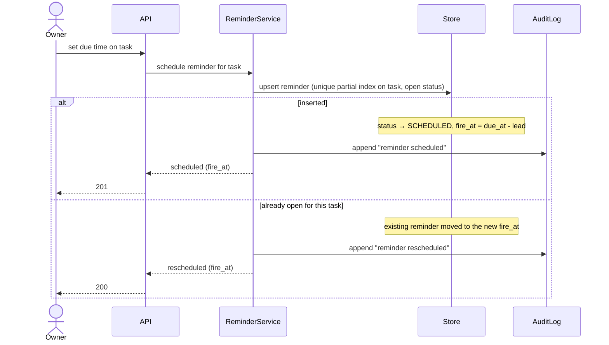
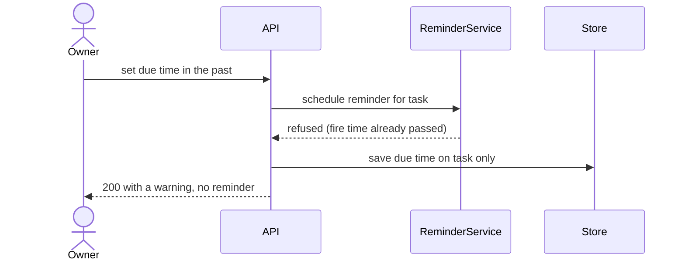
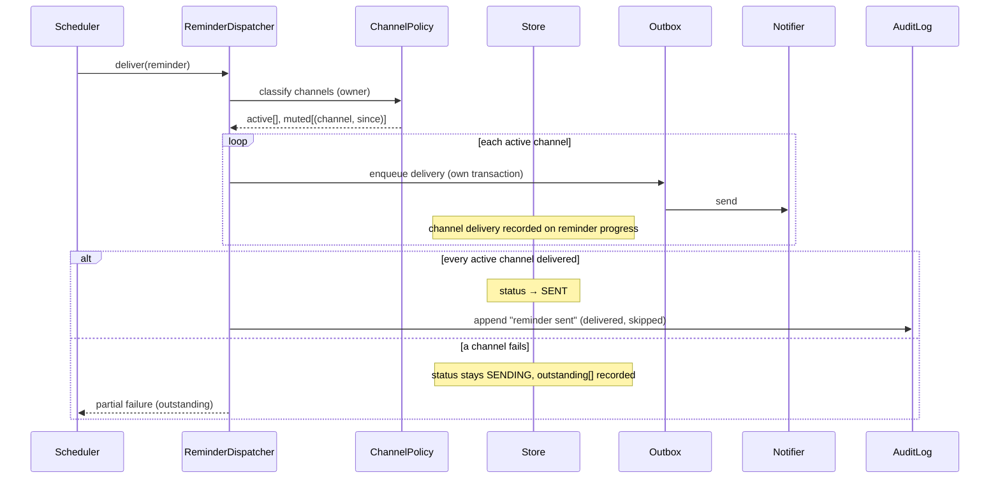

# Design: Due reminders

| Field | Value |
|---|---|
| slug | due-reminders |
| status | approved |
| spec | ./spec.md |

## Components
| Name | Responsibility | Location | Status |
|---|---|---|---|
| Web | List UI, due-time picker | apps/web | existing |
| API | HTTP surface, auth, validation | src/api | existing |
| ReminderService | Reminder lifecycle, fire-time calc, INV-01 | src/reminders/service.py | (new) |
| ReminderDispatcher | Channel-by-channel delivery honouring mutes | src/reminders/dispatch.py | (new) |
| ChannelPolicy | Which channels are muted for an owner, and since when | src/reminders/channels.py | (new) |
| Store | Postgres via SQLAlchemy | src/db | existing |
| Outbox | Transactional outbox + worker for notifier calls | src/outbox | (new) |
| Notifier | External email and push provider | external | existing |
| AuditLog | Append-only audit events | src/audit | existing |

## Sequence diagrams

### Scheduling

### Due time already past

### Delivery

### Not diagrammed
- None

## Contracts
### API
| Method | Path | Serves | Request | Response |
|---|---|---|---|---|
| PUT | /v1/tasks/{id}/due | REQ-01 | {due_at, lead_minutes?} | 201 {fire_at} / 200 {fire_at, rescheduled} / 200 {warning} |
| GET | /v1/tasks/{id}/reminder | REQ-02 | (auth cookie) | 200 {status, delivered[], skipped[], outstanding[]} |

### Events
| Name | Direction | Serves | Payload |
|---|---|---|---|
| outbox.reminder | internal | REQ-02 | reminder_id, channel, task_title, due_at |

### Data
- `reminders` (new): id, task_id, status, fire_at, lead_minutes, created_at
- partial unique index on (task_id) where status in (SCHEDULED, SENDING) — enforces INV-01 and X-01
- `reminder_progress` (new): reminder_id, channel, state (delivered|failed|muted|pending), updated_at
- `outbox` (new): id, kind, payload, attempts, next_attempt_at, failed

### Configuration / permissions
- `REMINDER_DEFAULT_LEAD_MINUTES=60`
- Only the task owner reads the delivery view

## Decisions
### D-01: Enforce INV-01 with a partial unique index, not an application check
- Context: concurrent due-time edits (X-01) must yield one Reminder.
- Decision: rely on a partial unique index and treat the violation as the reschedule path.
- Alternatives: check-then-insert in the service — rejected because it races under concurrency.
- Consequences: easier: X-01 is free; harder: the reschedule path needs a second read to move the existing reminder.

### D-02: Transactional outbox for notifier calls
- Context: X-02 requires acknowledging within 2s regardless of notifier latency.
- Decision: write deliveries to an outbox in the same transaction; a worker delivers and records attempts.
- Alternatives: call the notifier inline — rejected because it couples latency to an external provider.
- Consequences: easier: retries and visibility; harder: one more worker to operate.

### D-03: Per-channel transactions during delivery
- Context: S-02.3 requires an already-delivered channel to stay delivered when another fails.
- Decision: enqueue and record each channel in its own transaction.
- Alternatives: one transaction for the fan-out — rejected because a rollback would re-send a channel the owner already received.
- Consequences: easier: resumable delivery; harder: partial state must be shown to the owner.

## Risks
- [partial failure mid-flow in delivery] → per-channel progress rows; delivery is idempotent and resumes from outstanding[]
- [rollback of the feature] → tables are additive; stop the scheduler; no data migration to reverse
- [notifier down for hours] → outbox backs off; the delivery view shows failed channels; the due time itself is unaffected
- [a muted channel is misread as active] → policy is data-driven and covered by T-02.1b; the audit event records what was skipped

## UI notes
- Web: due-time picker → confirmed state with the fire time (S-01.1); rescheduled state (S-01.2); past-time warning (S-01.3)
- Delivery view surfaces delivered, skipped and outstanding channels

## Test hooks
- S-01.3: freeze the clock, set a due time behind it, assert no reminder row
- S-02.3: Notifier fake raising on a chosen channel; inspect reminder_progress
- X-01: two concurrent due-time writes via thread pool against a real Postgres
- X-02: Notifier fake with 5s sleep; measure API latency
- Async outcomes: run the outbox worker synchronously in tests via `run_outbox_once()`
