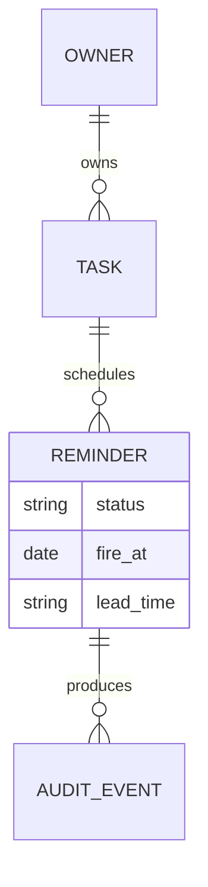
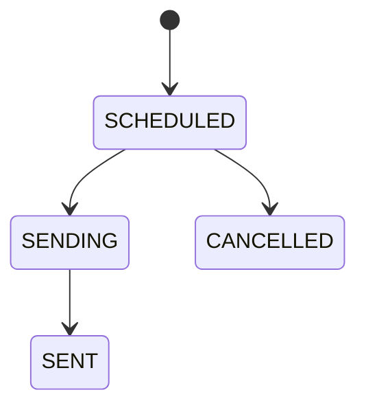

# Domain: Tally (example excerpt)

| Field | Value |
|---|---|
| updated | 2026-09-08 |

## Glossary
| Term | Definition | Notes |
|---|---|---|
| Task | A unit of work on a list, optionally with a due time | not "todo" in code |
| Reminder | A scheduled intent to notify the owner before a Task is due | not "notification"; that is the delivered message |
| Channel | A route a Reminder can be delivered on: email or push | |
| Muted channel | A Channel the owner has switched off for reminders | skipped, never failed |
| Lead time | How long before the due time the Reminder fires | default 1 hour |

## Entities and relationships

## Lifecycles
### Reminder

Transition rules:
- SCHEDULED → SENDING: the scheduler picks the Reminder up at fire_at
- SENDING → SENT: every unmuted channel has been delivered
- SCHEDULED → CANCELLED: the Task is completed or its due date is removed

## Invariants
- INV-01: A Task has at most one Reminder in SCHEDULED or SENDING.
- INV-02: A muted Channel never receives a delivery.
